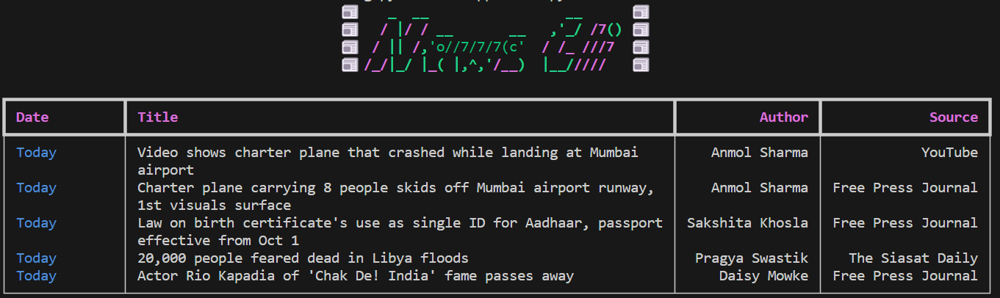

# News Cli
```
 
  _  _    _  __               __       _  _  
 // //   / |/ / __       __ ,'_/ /7()  \\ \\ 
<< <<   / || /,'o//7/7/7(c'/ /_ ///7    >> >>
 \\ \\ /_/|_/ |_( |,^,'/__)|__/////    // // 
                                            
version - 0.1b(Under Beta)
                                
```
### "Catch Up with daily news using your command line"
Q - Want to Read daily trending news in your terminal?

News Cli has got your back

Using inshorts api and rich python library we have made a news app in your terminal just do the installation steps and read your daily news in terminal.


# Preview



# Installation
```
pip install -r requirement.txt
run newscli.py
```

# LICENCE
GPL - 3